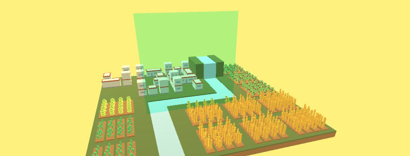

# UI Blur

[博文链接](https://llapuras.top/Unity-UI-Blur/)

### BlurUI_000.shader

### BlurUI_001.shader

### BlurUI_002.shader

### Sample

----------------------------

### ScreenBlur.cs

不用着色器的屏幕Blur效果(降采样)。

### ScreenBlur_progressive.cs & ScreenBlur_progressive.shader

降采样+上采样的全屏Blur效果。

